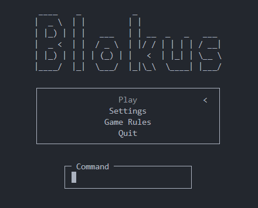
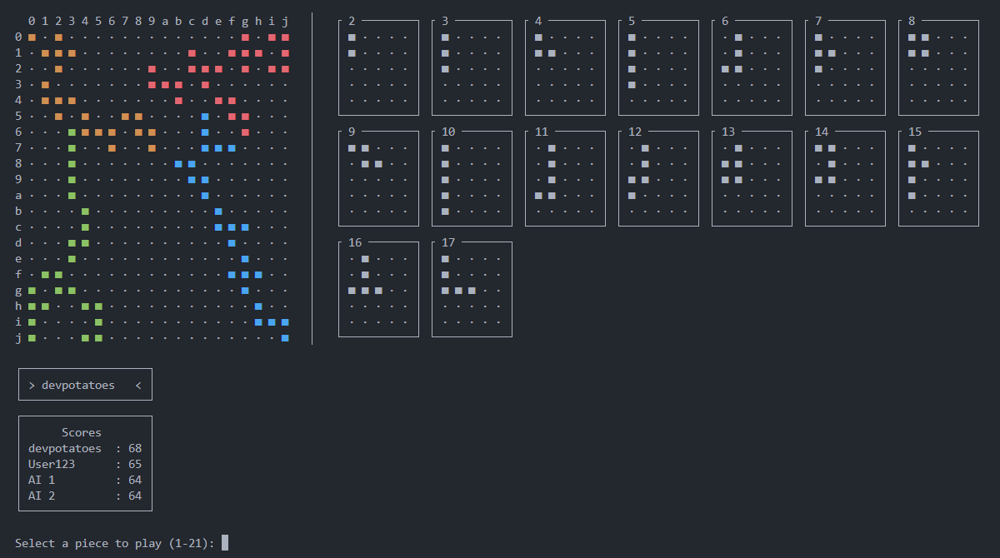
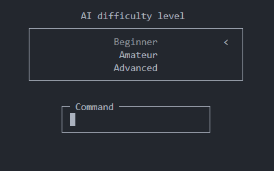

```text
 ____    _           _                      
|  _ \  | |         | |                    
| |_) | | |   ___   | | __  _   _   ___    🟨🟨🟩🟩
|  _ <  | |  / _ \  | |/ / | | | | / __|   🟨🟨🟩🟩
| |_) | | | | (_) | |   <  | |_| | \__ \   🟥🟥🟦🟦
|____/  |_|  \___/  |_|\_\  \____| |___/   🟥🟥🟦🟦
```

# Console-based Blokus

## Overview

> [!IMPORTANT]
> This project is mainly intended for Linux.  
> It may require adjustments to work on Windows or macOS.

This project is a console-based implementation of the Blokus board game in C.

It features a text-based interface, support for up to 4 players (human or AI), multiple AI difficulty levels, real-time board and score display, and robust input handling.

It was originally a school project, but I took more time to go a bit further. It is also my first C project !

---

## Main features

- **Text-based interface**

   

- **Up to 4 players** (human and/or AI)
- **Dynamic board and score display**

   

- **Three AI difficulty levels**: Beginner, Amateur, Advanced

   

---

## Compilation

> [!TIP]
> The repository also contains a precompiled executable `blokus`.  

Simply execute the `blokus.sh` script and it will automatically compile and then launch the game.